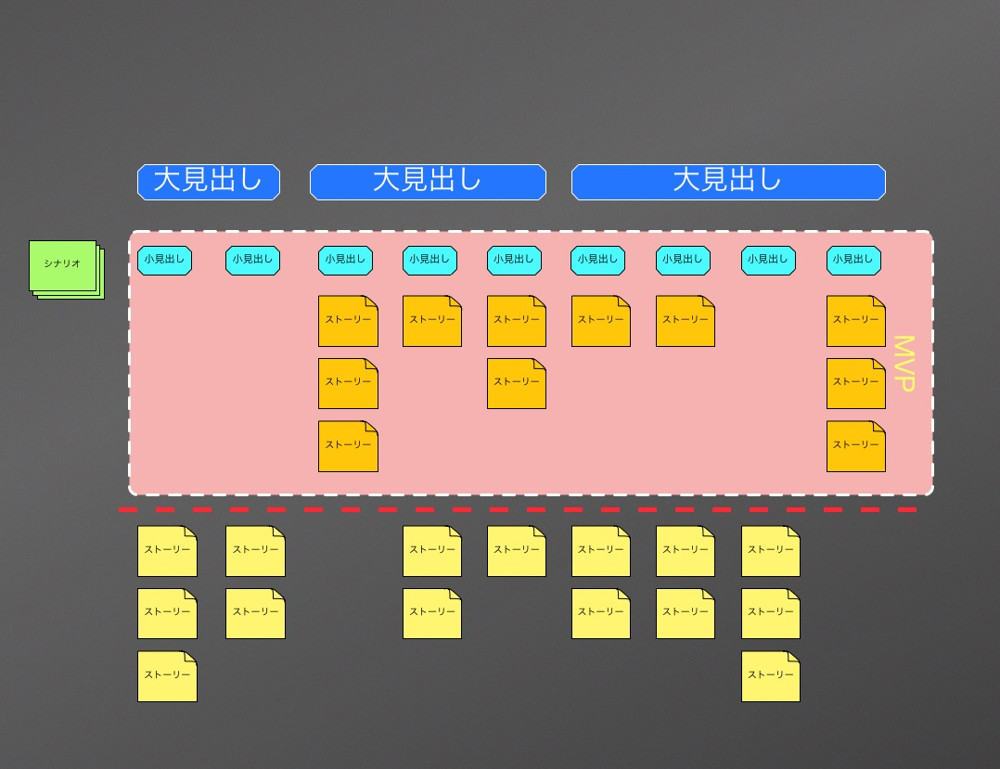

# マップの説明

## 全体イメージ

マップは、左から右が時間軸（左側のストーリーほど過去、右側は未来）です。  
また、上から下が優先度（上のストーリーほど優先度が高く、下は低い）です。

### シナリオ

「初めてサイトを訪れたユーザーが、商品を買う」といったシナリオになります。  
シナリオの中に、下記の様々な要素でストーリーが詰まっています。

### 大見出し・小見出し

ストーリーのカテゴリです。  
これらをつけることで、数あるストーリーを分別して理解しやすくします。

### ストーリー

ユーザーストーリーです。  
ユーザーは色々なストーリーを経てシナリオを満たすことになります。

### MVP

`Minimum Viable Product`の略になります。  
実用の上で最小限の構成を持つ製品を指します。  
つまり、そのシナリオを満たすために必要最低限のものを整理します。
