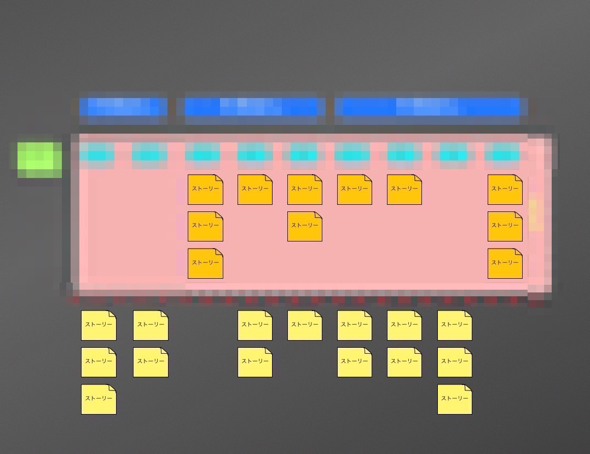

# ストーリーを並べる

## 制限時間

<form name="timer">
  <input type="text" maxlength="2" value="10" style="font-size:48pt;width:100px;text-align:right">分
  <input type="text" maxlength="2" value="0" style="font-size:48pt;width:100px;text-align:right">秒
    
  <input type="button" value="スタート" onclick="cntStart()">　
  <input type="button" value="ストップ" onclick="cntStop()">
</form>

## やること

作成したユーザーストーリーを並べてください。

* グルーピングしてください
* 左から右に時系列になるように並べてください
* 上から下に優先順になるように並べてください

