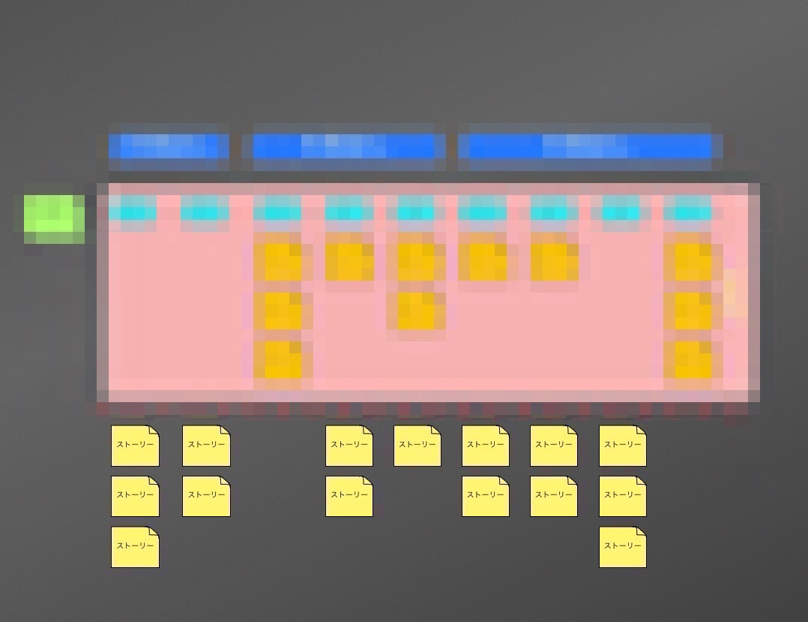

# ユーザーストーリーを作成する

## 制限時間

<form name="timer">
  <input type="text" maxlength="2" value="10" style="font-size:48pt;width:100px;text-align:right">分
  <input type="text" maxlength="2" value="0" style="font-size:48pt;width:100px;text-align:right">秒
  <br><br>
  <input type="button" value="スタート" onclick="cntStart()">　
  <input type="button" value="ストップ" onclick="cntStop()">
</form>

## やること

お題のプロダクトに関するシナリオ内で考えられるユーザーストーリーを、**出来るだけたくさん**作ってください。

##### ストーリーフォーマット1

```
[ユーザー]は、[行動]したい。なぜなら[得られる価値]だからだ。
```

##### ストーリーフォーマット2

```
[ユーザー]は、[得られる価値]のために[行動]したい。
```



<script type="text/javascript" src="../js/timer.js"></script>
